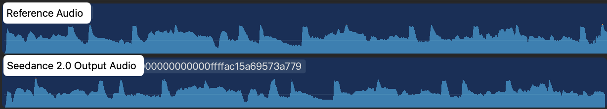
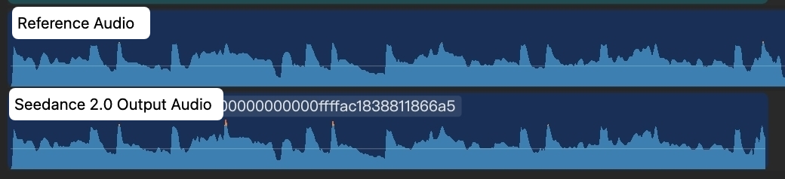
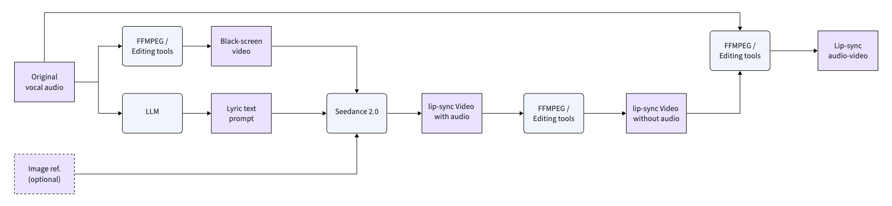
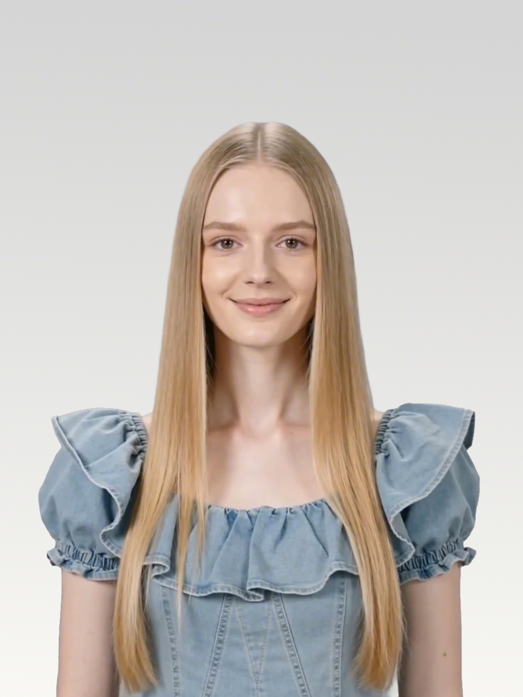

# Seedance 2.0 Audio Reference Not Working? Try This Workflow

Seedance 2.0 natively supports audio reference, but directly using audio as a reference may cause significant differences between the generated audio and the original audio.

This is especially noticeable with music. The output may sound similar, but when compared with the original audio, the rhythm and intervals can be different. Each generation may also have randomness.



This workflow provides a method to make Seedance 2.0 output much more consistent with the input audio. The output audio is not 100% identical to the input audio, but the consistency is enough for lip-syncing between the original audio and the character video generated by Seedance 2.0.



This can help reduce post-production adjustment costs during MV production.

---

## Core Workflow: Convert the Audio into a Black Screen Video

The key solution is:

> Convert the audio segment into a black screen video, then use the black screen video as the input for Seedance 2.0.



## How to Use Audio Reference More Effectively

### Step 1: Prepare the Materials

**Original audio** (generated by Suno):

<audio controls>
  <source src="./audio/fbc710.mp3" type="audio/mpeg">
</audio>

[Open Original Audio](./audio/fbc710.mp3)

**Lyrics:**

```text
Waking up to golden light. Coffee warm and feeling right.
Birds are singing just for me. Living life so wild and free.
This is my beautiful life. Every moment shining bright.
Dancing through the ups and downs. Wearing joy like a crown.
Beautiful life, oh yeah. Beautiful life
```
**Image reference:**

 

### Step 2: Split the Audio

Since Seedance 2.0 supports videos no longer than 15 seconds, split the 1-minute audio into multiple segments.

### Step 3: Convert Audio Segments into Black Screen Videos

Convert each audio segment into a black screen video.

> ⚠️ Key step: This helps keep the generated result highly consistent with the input audio.

Example FFmpeg command:

```bash
ffmpeg -f lavfi -i color=c=black:s=1280x720:r=24 -i clip1_audio.mp3 -shortest -c:v libx264 -c:a aac clip1.mp4
```


### Step 4: Generate with Seedance 2.0

Use the black screen video as the input for Seedance 2.0.

> ⚠️ The output duration must be strictly consistent with the input video duration.

### Final Results

### Results

| # | Black screen video | Lyrics | Prompt | Output Video |
|---|---|---|---|---|
| 1 | [clip1.mp4](./black-screen-videos/clip1.mp4) | woo~ | Use the audio from Video 1 to drive the protagonist in Image 1 to generate an MV with multiple shots, creating an overall light, lively, and sunny atmosphere. Lip-sync is strictly synchronized: "woo~ woo~" | [output_clip1.mp4](./outputs/output_clip1.mp4) |
| 2 | [clip2.mp4](./black-screen-videos/clip2.mp4) | Waking up to golden light. Coffee warm and feeling right. | Use the audio from Video 1 to drive the protagonist in Image 1 to generate an MV with multiple shots, change the outfit and background, and create an overall light, lively, and sunny atmosphere. Lip-sync strictly: "Waking up to golden light. Coffee warm and feeling right." | [output_clip2.mp4](./outputs/output_clip2.mp4) |
| 3 | [clip3.mp4](./black-screen-videos/clip3.mp4) | Birds are singing just for me. Living life so wild and free. | Use the audio from Video 1 to drive the protagonist in Image 1 to generate an MV with multiple shots, change the outfit and background, and create an overall light, lively, and sunny atmosphere. Lip-sync strictly: "Birds are singing just for me. Living life so wild and free." | [output_clip3.mp4](./outputs/output_clip3.mp4) |
| 4 | [clip3.mp4](./black-screen-videos/clip3.mp4) | This is my beautiful life  | Use the audio from Video 1 to drive the protagonist in Image 1 to generate an MV with multiple shots, change the outfit and background, and create an overall light, lively, and sunny atmosphere. Lip-sync strictly: “This is my beautiful life ” | [output_clip3.mp4](./outputs/output_clip3.mp4) |
| 5 | [clip3.mp4](./black-screen-videos/clip3.mp4) | Every moment shining bright，Dancing through the ups and downs. Wearing joy like a crown.  | Use the audio from Video 1 to drive the protagonist in Picture 1 to generate an MV with multiple shots, change the outfit and background, and create an overall light, lively, and sunny atmosphere. Lip-sync strictly: “Every moment shining bright, Dancing through the ups and downs. Wearing joy like a crown.” | [output_clip3.mp4](./outputs/output_clip3.mp4) |
| 6 | [clip3.mp4](./black-screen-videos/clip3.mp4) | woo～ Beautiful life, oh yeah Beautiful life. | Use the audio from Video 1 to drive the protagonist in Image 1 to generate an MV with multiple shots, change the outfit and background, and create an overall light, lively, and sunny atmosphere. Lip-sync strictly: "woo～ Beautiful life, oh yeah Beautiful life"  | [output_clip3.mp4](./outputs/output_clip3.mp4) |
